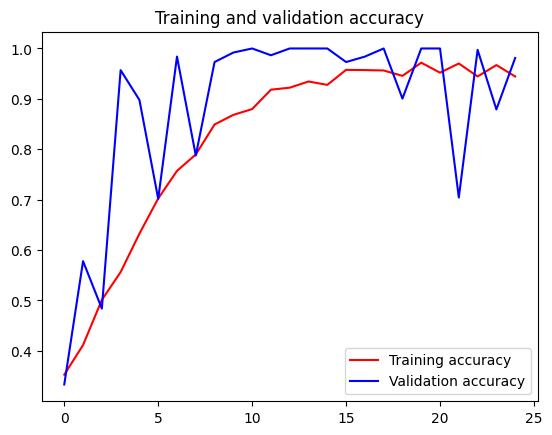

TensorFlow训练石头剪刀布数据集
```python
import os
import zipfile

local_zip = 'D:/mldownload/rps.zip'
zip_ref = zipfile.ZipFile(local_zip, 'r')
zip_ref.extractall('D:/mldownload/')
zip_ref.close()

local_zip = 'D:/mldownload/rps-test-set.zip'
zip_ref = zipfile.ZipFile(local_zip, 'r')
zip_ref.extractall('D:/mldownload/')
zip_ref.close()

```


```python
rock_dir = os.path.join('D:/mldownload/rps/rock')
paper_dir = os.path.join('D:/mldownload/rps/paper')
scissors_dir = os.path.join('D:/mldownload/rps/scissors')

print('total training rock images:', len(os.listdir(rock_dir)))
print('total training paper images:', len(os.listdir(paper_dir)))
print('total training scissors images:', len(os.listdir(scissors_dir)))

rock_files = os.listdir(rock_dir)
print(rock_files[:10])

paper_files = os.listdir(paper_dir)
print(paper_files[:10])

scissors_files = os.listdir(scissors_dir)
print(scissors_files[:10])

```

    total training rock images: 840
    total training paper images: 840
    total training scissors images: 840
    ['rock01-000.png', 'rock01-001.png', 'rock01-002.png', 'rock01-003.png', 'rock01-004.png', 'rock01-005.png', 'rock01-006.png', 'rock01-007.png', 'rock01-008.png', 'rock01-009.png']
    ['paper01-000.png', 'paper01-001.png', 'paper01-002.png', 'paper01-003.png', 'paper01-004.png', 'paper01-005.png', 'paper01-006.png', 'paper01-007.png', 'paper01-008.png', 'paper01-009.png']
    ['scissors01-000.png', 'scissors01-001.png', 'scissors01-002.png', 'scissors01-003.png', 'scissors01-004.png', 'scissors01-005.png', 'scissors01-006.png', 'scissors01-007.png', 'scissors01-008.png', 'scissors01-009.png']
    


```python
%matplotlib inline

import matplotlib.pyplot as plt
import matplotlib.image as mpimg

pic_index = 2

next_rock = [os.path.join(rock_dir, fname) 
                for fname in rock_files[pic_index-2:pic_index]]
next_paper = [os.path.join(paper_dir, fname) 
                for fname in paper_files[pic_index-2:pic_index]]
next_scissors = [os.path.join(scissors_dir, fname) 
                for fname in scissors_files[pic_index-2:pic_index]]

for i, img_path in enumerate(next_rock+next_paper+next_scissors):
  #print(img_path)
  img = mpimg.imread(img_path)
  plt.imshow(img)
  plt.axis('Off')
  plt.show()

```


    

    


    

    


    

    


    

    


    

    


    

    


调用TensorFlow的keras进行数据模型的训练和评估。Keras是开源人工神经网络库，TensorFlow集成了keras的调用接口，可以方便的使用。

```python
import tensorflow as tf
import keras_preprocessing
from keras_preprocessing import image
from keras_preprocessing.image import ImageDataGenerator

TRAINING_DIR = "D:/mldownload/rps/"
training_datagen = ImageDataGenerator(
      rescale = 1./255,
	    rotation_range=40,
      width_shift_range=0.2,
      height_shift_range=0.2,
      shear_range=0.2,
      zoom_range=0.2,
      horizontal_flip=True,
      fill_mode='nearest')

VALIDATION_DIR = "D:/mldownload/rps-test-set/"
validation_datagen = ImageDataGenerator(rescale = 1./255)

train_generator = training_datagen.flow_from_directory(
	TRAINING_DIR,
	target_size=(150,150),
	class_mode='categorical',
  batch_size=126
)

validation_generator = validation_datagen.flow_from_directory(
	VALIDATION_DIR,
	target_size=(150,150),
	class_mode='categorical',
  batch_size=126
)

model = tf.keras.models.Sequential([
    # Note the input shape is the desired size of the image 150x150 with 3 bytes color
    # This is the first convolution
    tf.keras.layers.Conv2D(64, (3,3), activation='relu', input_shape=(150, 150, 3)),
    tf.keras.layers.MaxPooling2D(2, 2),
    # The second convolution
    tf.keras.layers.Conv2D(64, (3,3), activation='relu'),
    tf.keras.layers.MaxPooling2D(2,2),
    # The third convolution
    tf.keras.layers.Conv2D(128, (3,3), activation='relu'),
    tf.keras.layers.MaxPooling2D(2,2),
    # The fourth convolution
    tf.keras.layers.Conv2D(128, (3,3), activation='relu'),
    tf.keras.layers.MaxPooling2D(2,2),
    # Flatten the results to feed into a DNN
    tf.keras.layers.Flatten(),
    tf.keras.layers.Dropout(0.5),
    # 512 neuron hidden layer
    tf.keras.layers.Dense(512, activation='relu'),
    tf.keras.layers.Dense(3, activation='softmax')
])


model.summary()

model.compile(loss = 'categorical_crossentropy', optimizer='rmsprop', metrics=['accuracy'])

history = model.fit(train_generator, epochs=25, steps_per_epoch=20, validation_data = validation_generator, verbose = 1, validation_steps=3)

model.save("rps.h5")

```

    Found 2520 images belonging to 3 classes.
    Found 372 images belonging to 3 classes.
    Model: "sequential"
    _________________________________________________________________
     Layer (type)                Output Shape              Param #   
    =================================================================
     conv2d (Conv2D)             (None, 148, 148, 64)      1792      
                                                                     
     max_pooling2d (MaxPooling2D  (None, 74, 74, 64)       0         
     )                                                               
                                                                     
     conv2d_1 (Conv2D)           (None, 72, 72, 64)        36928     
                                                                     
     max_pooling2d_1 (MaxPooling  (None, 36, 36, 64)       0         
     2D)                                                             
                                                                     
     conv2d_2 (Conv2D)           (None, 34, 34, 128)       73856     
                                                                     
     max_pooling2d_2 (MaxPooling  (None, 17, 17, 128)      0         
     2D)                                                             
                                                                     
     conv2d_3 (Conv2D)           (None, 15, 15, 128)       147584    
                                                                     
     max_pooling2d_3 (MaxPooling  (None, 7, 7, 128)        0         
     2D)                                                             
                                                                     
     flatten (Flatten)           (None, 6272)              0         
                                                                     
     dropout (Dropout)           (None, 6272)              0         
                                                                     
     dense (Dense)               (None, 512)               3211776   
                                                                     
     dense_1 (Dense)             (None, 3)                 1539      
                                                                     
    =================================================================
    Total params: 3,473,475
    Trainable params: 3,473,475
    Non-trainable params: 0
    _________________________________________________________________
    Epoch 1/25
    20/20 [==============================] - 40s 2s/step - loss: 1.4675 - accuracy: 0.3528 - val_loss: 1.0794 - val_accuracy: 0.3333
    Epoch 2/25
    20/20 [==============================] - 37s 2s/step - loss: 1.1340 - accuracy: 0.4115 - val_loss: 0.8915 - val_accuracy: 0.5780
    Epoch 3/25
    20/20 [==============================] - 45s 2s/step - loss: 1.1006 - accuracy: 0.5012 - val_loss: 0.8438 - val_accuracy: 0.4839
    Epoch 4/25
    20/20 [==============================] - 44s 2s/step - loss: 0.9014 - accuracy: 0.5563 - val_loss: 0.4668 - val_accuracy: 0.9570
    Epoch 5/25
    20/20 [==============================] - 45s 2s/step - loss: 0.7901 - accuracy: 0.6325 - val_loss: 0.3338 - val_accuracy: 0.8978
    Epoch 6/25
    20/20 [==============================] - 45s 2s/step - loss: 0.6886 - accuracy: 0.7024 - val_loss: 0.5069 - val_accuracy: 0.7016
    Epoch 7/25
    20/20 [==============================] - 44s 2s/step - loss: 0.5534 - accuracy: 0.7571 - val_loss: 0.2292 - val_accuracy: 0.9839
    Epoch 8/25
    20/20 [==============================] - 44s 2s/step - loss: 0.5054 - accuracy: 0.7897 - val_loss: 0.3357 - val_accuracy: 0.7876
    Epoch 9/25
    20/20 [==============================] - 45s 2s/step - loss: 0.3661 - accuracy: 0.8492 - val_loss: 0.1164 - val_accuracy: 0.9731
    Epoch 10/25
    20/20 [==============================] - 47s 2s/step - loss: 0.3208 - accuracy: 0.8683 - val_loss: 0.0357 - val_accuracy: 0.9919
    Epoch 11/25
    20/20 [==============================] - 45s 2s/step - loss: 0.2871 - accuracy: 0.8798 - val_loss: 0.0876 - val_accuracy: 1.0000
    Epoch 12/25
    20/20 [==============================] - 45s 2s/step - loss: 0.2173 - accuracy: 0.9183 - val_loss: 0.0356 - val_accuracy: 0.9866
    Epoch 13/25
    20/20 [==============================] - 44s 2s/step - loss: 0.2033 - accuracy: 0.9222 - val_loss: 0.0191 - val_accuracy: 1.0000
    Epoch 14/25
    20/20 [==============================] - 45s 2s/step - loss: 0.1766 - accuracy: 0.9345 - val_loss: 0.0120 - val_accuracy: 1.0000
    Epoch 15/25
    20/20 [==============================] - 43s 2s/step - loss: 0.1982 - accuracy: 0.9278 - val_loss: 0.0122 - val_accuracy: 1.0000
    Epoch 16/25
    20/20 [==============================] - 43s 2s/step - loss: 0.1185 - accuracy: 0.9575 - val_loss: 0.0550 - val_accuracy: 0.9731
    Epoch 17/25
    20/20 [==============================] - 43s 2s/step - loss: 0.1185 - accuracy: 0.9571 - val_loss: 0.0359 - val_accuracy: 0.9839
    Epoch 18/25
    20/20 [==============================] - 43s 2s/step - loss: 0.1235 - accuracy: 0.9563 - val_loss: 0.0081 - val_accuracy: 1.0000
    Epoch 19/25
    20/20 [==============================] - 44s 2s/step - loss: 0.1906 - accuracy: 0.9456 - val_loss: 0.1633 - val_accuracy: 0.9005
    Epoch 20/25
    20/20 [==============================] - 43s 2s/step - loss: 0.0847 - accuracy: 0.9718 - val_loss: 0.0149 - val_accuracy: 1.0000
    Epoch 21/25
    20/20 [==============================] - 44s 2s/step - loss: 0.1373 - accuracy: 0.9520 - val_loss: 0.0390 - val_accuracy: 1.0000
    Epoch 22/25
    20/20 [==============================] - 44s 2s/step - loss: 0.0818 - accuracy: 0.9702 - val_loss: 1.1316 - val_accuracy: 0.7043
    Epoch 23/25
    20/20 [==============================] - 43s 2s/step - loss: 0.1747 - accuracy: 0.9444 - val_loss: 0.0146 - val_accuracy: 0.9973
    Epoch 24/25
    20/20 [==============================] - 43s 2s/step - loss: 0.0905 - accuracy: 0.9671 - val_loss: 0.3367 - val_accuracy: 0.8790
    Epoch 25/25
    20/20 [==============================] - 43s 2s/step - loss: 0.1600 - accuracy: 0.9444 - val_loss: 0.0483 - val_accuracy: 0.9812
    


ImageDataGenerator是Keras中图像预处理的类，经过预处理使得后续的训练更加准确。

Sequential定义了序列化的神经网络，封装了神经网络的结构，有一组输入和一组输出。可以定义多个神经层，各层之间按照先后顺序堆叠，前一层的输出就是后一层的输入，通过多个层的堆叠，构建出神经网络。

神经网络两个常用的操作：卷积和池化。由于图片中可能包含干扰或者弱信息，使用卷积处理（此处的Conv2D函数）使得我们能够找到特定的局部图像特征（如边缘）。此处使用了3X3的滤波器（通常称为垂直索伯滤波器）。而池化（此处的MaxPooling2D）的作用是降低采样，因为卷积层输出中包含很多冗余信息。池化通过减小输入的大小降低输出值的数量。详细的信息可以参考知乎回答“如何理解卷积神经网络（CNN）中的卷积和池化？”。更多的卷积算法参考Github Convolution arithmetic。

Dense的操作即全连接层操作，本质就是由一个特征空间线性变换到另一个特征空间。Dense层的目的是将前面提取的特征，在dense经过非线性变化，提取这些特征之间的关联，最后映射到输出空间上。Dense这里作为输出层。


```python
import matplotlib.pyplot as plt
acc = history.history['accuracy']
val_acc = history.history['val_accuracy']
loss = history.history['loss']
val_loss = history.history['val_loss']

epochs = range(len(acc))

plt.plot(epochs, acc, 'r', label='Training accuracy')
plt.plot(epochs, val_acc, 'b', label='Validation accuracy')
plt.title('Training and validation accuracy')
plt.legend(loc=0)
plt.figure()
plt.show()

```


    

    


    <Figure size 640x480 with 0 Axes>


```python

```
